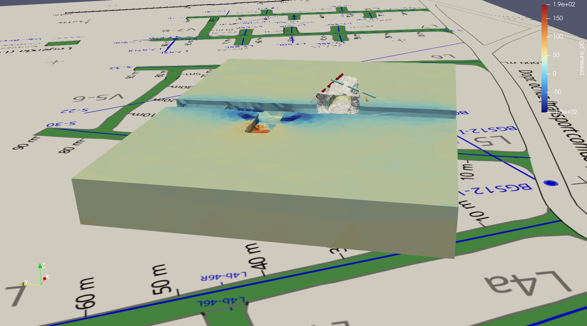

# Example Dataset

## How to open in Paraview

### [Install Paraview](https://www.paraview.org/download/)

Download, extract, run.

### Openning *.pvsm scene file

1. start paraview
2. File > Load State... > select `example_scene3.pvsm` > OK >  select: "Search files under specified directory" > OK 

Basic control:

- View > select "Pipeline Browser"; In Pipeline Browser select which data show in the scene.
- [Basic Usage](https://docs.paraview.org/en/latest/Tutorials/SelfDirectedTutorial/basicUsage.html#user-interface)

## Description of the Dataset

## map or the Bukov URF II 
source file `fotogrametrie/PVP Bukov II k 08-2024 bez stufu, srafa.png`; original is vector graphics in PDF
need a georeferencing and transform to a local coordinate system (rotation, scaling, translation)

## stress and flow model data around L5 tunnel

source files: 

`HM_model_curved_tunnel/flow.pvd` + flow dir
`HM_model_curved_tunnel/mechanics.pvd` + mechanics dir

- Individual files are for different times.
- Each file in VTU format consists of a) points in 3D b) cells with vertices in the points c) data on the points or cells

## laserscan + fotogrametry of L5-1J test chamber

source files:
`fotogrametrie/PVP_Bukov_II_Model_a_data_2025.obj` - core is large cloud of points, optionaly surface triangles
`fotogramerie/ZK5-1J_PTG_SJTSK.png` - rock texture; not sure how precise, very limited ability to view this

## Boreholes
- 8 boreholes two around ZK5-1S, 6 around ZK5-1J
- cylinders depict pressure measurement chambers (cylinders); the diameter is amplified
- borehole labels stored as `FieldData`; prototype how to store any object metadata including links

### How to show boreholoe labels
Setup to create a ParaView scene that reads from a VTM/VTP file the borehole geometry and field data that is used to create labels.

1. Open ParaView menu Tools->Manage Plugins, select "Load New..." and choose "pvDataLabelRepresentation.xml". This creates a new representation "Labels". Maybe the restart of ParaView application will be necessary.
2. Open menu View->Python Shell, select "Run Script" and choose "boreholes_paraview_annotation.py". The script loads the VTK multiblock data and creates a source for borehole labels.

